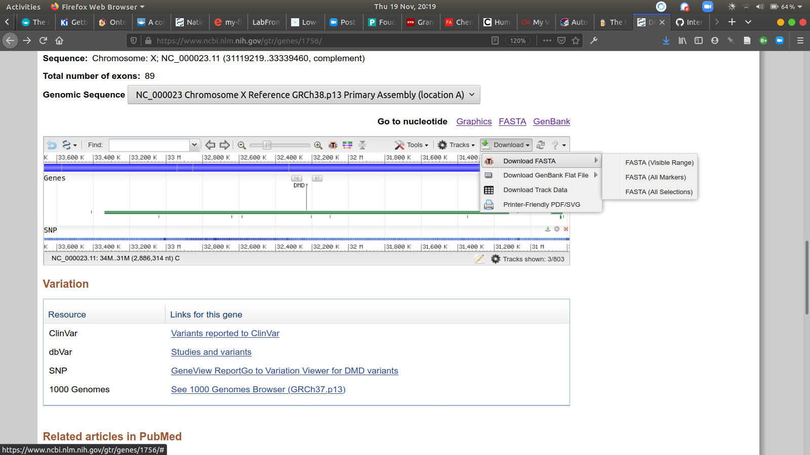

## DNA Play

[](https://asciinema.org/a/308287)


Experimenting with visualising the Muscular Dystrophy human genome in text using the terminal.

Text analysis from the command line is a core skill in computer science, and it also likely a skill in bioinformatics. Im interested in how a beginner in the world of bash scripts and the linux/UNIX (MacOS) command line might start engaging with bioinformatics in some way.

If you're interested there's a great tutorial in [linuxcommand](https://linuxcommand.org) and learning Vim [Vim Tutorial](https://www.linux.com/training-tutorials/vim-101-beginners-guide-vim/)


I did some animations above with this [drawHelix](https://github.com/cheapjack/InterspeciesGaming/blob/master/DNA/drawHelix.sh) bash script from [BioSyntax](http://biosyntax.org) which i then screenrecorded with [asciicinema](asciinema.org/) which you can install  via [PipX](https://pypi.org/project/pipx/). It's really like treating code like a text adventure and I wonder where else this could go if you had a deeper literacy in the field.

I like how it stays with the trouble of material practices of vim, git, `.fasta`  & bash scripts in the abstractions and necessary reductions of bioinfomatics. 

### How to use

In the terminal run `drawHelix` which is a bash script which takes a `.fasta` file like [this one which represents a selected region of the human genome](https://www.ncbi.nlm.nih.gov/nuccore/NC_000023.11?report=fasta&from=30786182&to=33672495&strand=true) specific to the mutations with respect to dystrophin and the family of neuromuscular (dis)orders. 

Run from a command line. It's best done in Terminal in OSX or any Linux terminal 

Experimented with the [DMD dystrophin NG_012232 RefSeqGene](https://www.ncbi.nlm.nih.gov/gtr/genes/1756/)

To see the sequence visualised, open a Terminal

Add permissions to `drawHelix.sh` shell script and run

`$ chmod 755 drawHelix.sh`

Display the `.fasta` file to standard OUT 

`$ ./drawHelix filename.fasta` to stream `.fasta` files from Repositories like the [Genetic Testing Registry](https://www.ncbi.nlm.nih.gov/) and visualise them on text 'strands' of DNA

eg. `$ ./drawHelix MuscularDystrophy.fasta` 

Quit with `ctrl` & `c`

### More detail for Mac users new to Command line

Open the Terminal application, its in /Applications/Utilities (the main Application folder, and in the Utilities subfolder)

Once open you can configure the view style as you like.

Now download the [drawHelix.sh](https://raw.githubusercontent.com/cheapjack/InterspeciesGaming/master/DNA/drawHelix.sh) file. Go to the link with all the text and choose `Save as` in your browser and save `drawHelix.sh` to your desktop. 

Now in a Terminal window (in the Terminal application) you'll get a prompt like

```
my-macbook-pro:~ MyName$  
``` 

you can now type in commands straight into the command line but be careful not to type any old thing you can cause damage if you dont know what you're typing! 

So typing `ls` into the flashing prompt followed by return/enter runs the list command. So before you hit enter it looks a bit like this 

```
my-macbook-pro:~ MyName$ ls
``` 

and it will list all the files in whatever directory you are in.

Now you need to find a `.fasta` file so go to the gene you want and scroll down to the little gene browser window at the bottom of the website and select the FASTA option and save it to your Desktop. Rename it to something friendly. Make sure the file ends in `.fa` or `.fasta`. Put it on your Desktop for now call it `DNAtest.fa` maybe 



In Terminal, Move to your desktop folder by typing

`cd ~/Desktop`


List all your files `ls` and you'll see a text list of whatevers there and the file `drawHelix.sh` and the fasta file you downloaded called `DNAtest.fa`


There are plenty of [tutorials](https://www.macworld.co.uk/how-to/how-use-terminal-on-mac-3608274/) on using the Terminal, and if you really want to learn more there's [linuxcommand](https://linuxcommand.org/) but just to get this working:

Next add permissions to the `drawHelix.sh` shell script

```
chmod 755 drawHelix.sh
``` 

Now you can run the script from the Terminal and it will 'read out the `.fasta` file line by line to the screen. To do this type:

```
./drawHelix.sh DNAtest.fa
```
You can change it to read another file, just change the file name.

It takes a long time to read it out, it's a long file! You can also open other terminal windows and run it at the same time. You could then capture the screen, use chroma keying maybe. 

Quit by pressing `ctrl` & `c`

I used a special screen recorder for text in the Terminal, but you can use any like [OBS Studio](https://obsproject.com/) but remember to style your text using the Terminal view options

