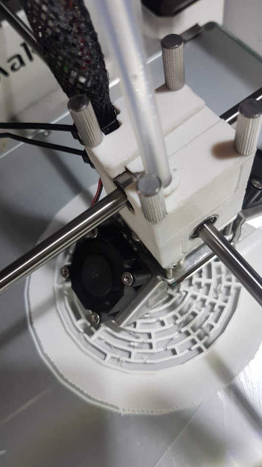

## Interspecies Gaming

Workshops exploring embodied biotic gamings with 3D printing and Drosophila, inspired by conversations with Isobel Paehr and Jasper Meiners of [TopicBird](http://thetopicbird.com/) at [DisruptEncodeConsolidate](https://cheapjack.github.io/DisruptEncodeConsolidate/documentation) and with the NeuroMuscular Centres [3DPrintClub](https://github.com/cheapjack/NMC3DPrintClub)
